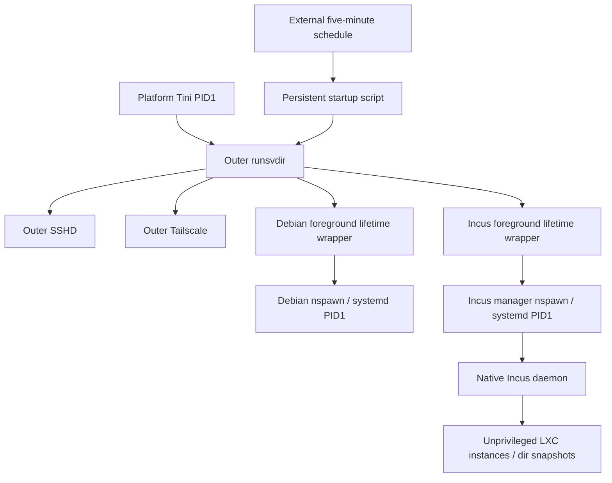

# Architecture

For selecting both, either or neither environment and changing launch settings,
see [environment configuration](CONFIGURATION.md). Enable/disable policy is
saved through infractl rather than launch-config TOML switches.

Runit is a service supervisor, not platform PID1. It scans four service
directories, runs one runsv for each and retains a separate svlogd log process.
Access daemons run in a private mount namespace/chroot using native packages
from infrastructure-rootfs; they share the outer PID/network namespaces.
That tools filesystem has its own locked operator account, sudo policy and SSH home.
Infrastructure controls work from that SSH session by entering outer PID1's mount/root.

Each guest wrapper adopts a healthy matching nspawn process or starts one. It
stays alive while that manager lives. TERM gracefully stops the guest; an
unexpected manager exit makes the wrapper fail so runit retries. PID records
include process birth ticks and executable/root identity checks. Launchers move
only their newly created process into owned child cgroups. No platform processes
or parent controllers are rearranged.

The Debian demo and Incus manager have independent configuration,
locks, disabled markers, PID records and rootfs. Systemd units inside Debian do
not own the outer access daemons. The Incus manager's native startup/shutdown
units restore previously running instances and leave stopped instances stopped.
The native Incus database and default dir storage pool remain under its
persistent /var/lib/incus. Its /run is disposable; startup reconstructs sockets
and API mounts from persistent units, not packages or identities.

## Nested mount and network compatibility

Nspawn masks parts of /proc and /sys. Unprivileged LXC needs fully visible
instances of procfs/sysfs in its parent mount namespace. A root-owned Incus
ExecStartPre helper mounts fresh API filesystems under root-private
/run/incus-nesting. It retains standard restrictions except the network sysctl
and network sysfs directories needed by this trusted network manager.

Owned outer infrastructure/Incus cgroup ancestors are 0755 so mapped instance
root can traverse kernel paths during cgroup namespace mount setup. Child
cgroups retain their native ownership. Configuration/state directories remain
0700 and private files 0600. This does not delegate CPU/memory/PID controllers.

Incus owns incusbr0 (10.88.0.1/24), DHCP/DNS and its nftables NAT rules. The
platform's legacy Docker FORWARD policy also applies. Two exact, commented
legacy rules permit this bridge/subnet to the physical default interface and
permit established/related return traffic. The helper checks before adding and
removes only its own rules on Incus service stop. It preserves Docker chains
and the platform's default route/DNS. An independent outer guard protects
explicit initial bridge/firewall configuration.

Native Debian packages provide runit, OpenSSH, Incus, LXC and firewall tools;
Tailscale uses its official signed Debian repository. This is an amd64-specific
implementation using the Debian ELF loader directly for outer runit tools.
The trusted manager profile requires root/CAP_SYS_ADMIN, NET_ADMIN, NET_RAW,
BPF/PERFMON and /dev/fuse. Instances default to unprivileged mapped UID ranges;
no privileged default profile is installed.

## Persistence boundaries

Source, rootfs and runtime are siblings, not one copied outer Debian system.
Each installed filesystem contains only its own native Debian base and role
packages. All software, package databases, configuration and user data needed
for restart are in the installation tree. Optional home command symlinks hold no second
installation. Secrets and runtime state never enter Git.

There is no verified platform reboot API here. Tests restart our complete
supervision and both management guests. If the platform replaces the root
filesystem without preserving the installation trees, this deployment is also lost.
Backups must preserve numeric owners, mapped UIDs, ACLs, xattrs and hardlinks.
